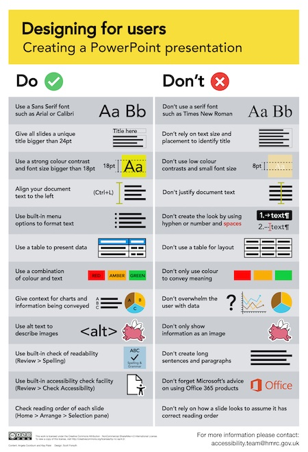

# Do/Don't for creating a PowerPoint presentation poster for your own Accessibility Empathy Hub

[High resolution image of the do/don't for creating a PowerPoint presentation poster (download PNG, 555 KB)](HMRC-AccessibilityEmpathyHub-DoDontPowerPoint%20%28High%20Resolution%20555%20KB%29.png)  
[PDF of the do/don't for creating a PowerPoint presentation poster (download PDF, 2.6 MB)](HMRC-AccessibilityEmpathyHub-DoDontPowerPoint%20%28PDF%202.6%20MB%29.pdf)  
[Textual content of the do/don't for creating a PowerPoint presentation poster (download MS Word, 26 KB)](HMRC-AccessibilityEmpathyHub-DoDontPowerPoint%20%28MS%20Word%2026%20KB%29.docx)

