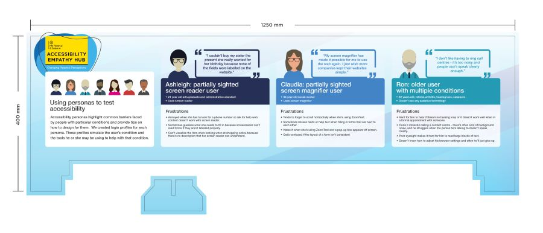
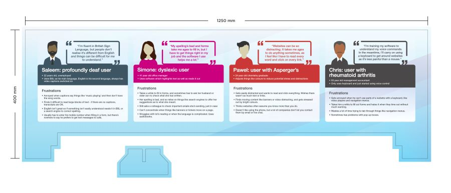

# Persona Board for your own Accessibility Empathy Hub

[High resolution image of the persona board 1 (download JPEG, 6.45 MB)](HMRC-AccessibilityEmpathyHub-PersonaBoard1%20%28High%20Resolution%206.45%20MB%29.jpg)  
[High resolution image of the persona board 2 (download JPEG, 6.66 MB)](HMRC-AccessibilityEmpathyHub-PersonaBoard2%20%28High%20Resolution%206.66%20MB%29.jpg)  
[Textual content of the persona board information (download MS Word, 16.9 KB)](HMRC-AccessibilityEmpathyHub-PersonaBoard%20%28MS%20Word%2016.9%20KB%29.docx)

