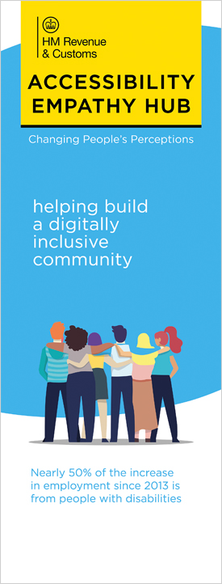
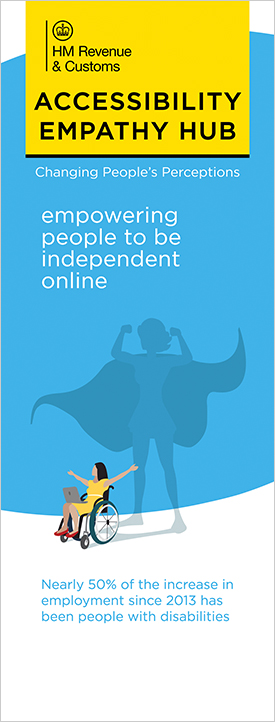

# Roller Banners for your own Accessibility Empathy Hub

High resolution images of the roller banners can be downloaded by clicking on the relevant image below. Note the downloads are JPEG and around 9 MB.

