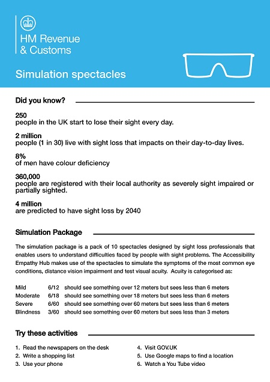
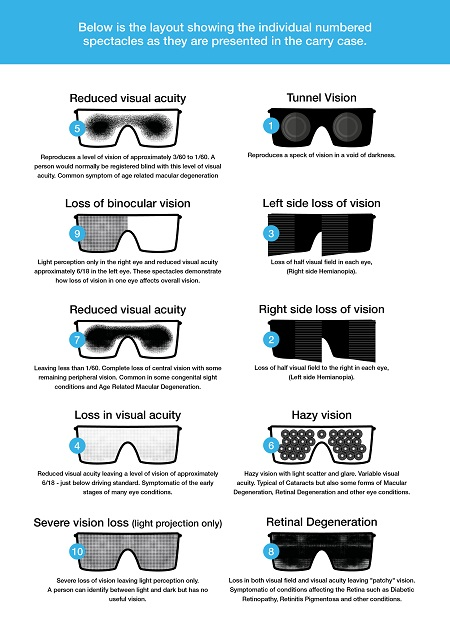

# Simulation Spectacles for your own Accessibility Empathy Hub

[High resolution image of simulation spectacles information 1 (download JPEG, 941 KB)](HMRC-AccessibilityEmpathyHub-SimulationSpectacles-Information1%20%28High%20Resolution%20941%20KB%29.jpg)  
[High resolution image of simulation spectacles information 2 (download JPEG, 1.17 MB)](HMRC-AccessibilityEmpathyHub-SimulationSpectacles-Information2%20%28High%20Resolution%201.17%20MB%29.jpg)  
[Textual content of the simulation spectacles information (download MS Word, 14 KB)](HMRC-AccessibilityEmpathyHub-SimulationSpectacles%20%28MS%20Word%2014%20KB%29.docx)

