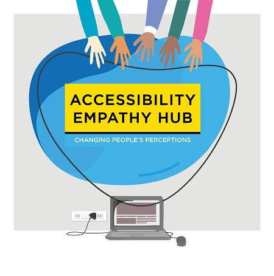

# Space Enclosure for your own Accessibility Empathy Hub

High resolution images of the space enclosure panel can be downloaded by clicking on the relevant preview image below. Note the downloads are JPEG and around 1 MB.

